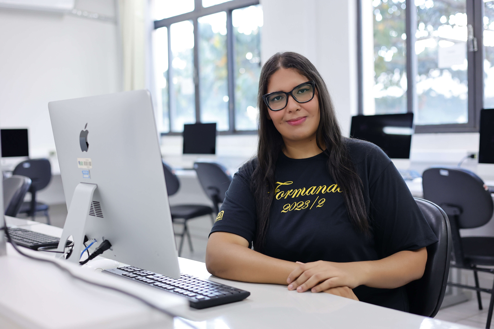

# MINHA BIO GCC259 - Currículo pessoal

```
cout << "Olá, me chamo Taiane Rodrigues de Sousa!";
```
<p align="center">
  
</p>

---

- 🎓 Estudante de Ciência da Computação na **Universidade Federal de Lavras** - UFLA
- 💻 Sou apaixonada por tecnologia e adoro aprender coisas novas
- 👩🏽‍💻 Programo profissionalmente há 3 anos

- 📫 Você pode me encontrar nos links ao clicar neste ícone: [](https://linktr.ee/taianers)

## Experiências profissionais


**Estagiária de desenvolvimento de software na [DTI DIGITAL](https://www.dtidigital.com.br/)**

Inicialmente desenvolvedora _full-stack_.
Tecnologias:

-  
-  
- 
- Time ágil, metodologia: _SCRUM_

Atualmente desenvolvedora _back-end_.
Tecnologias:

-  
- 
- Time ágil, metodologia: _Lean Kanban_

**Analista de desenvolvimento de sistemas na [YouX Group](https://youxgroup.com.br/)**

Desenvolvedora _full-stack_, porém maior parte da atuação em _back-end_.
Tecnologias:

-  
-  
- 
- Time ágil, metodologia: _SCRUM_

**Desenvolvedora front-end mobile na [Comp Júnior](https://compjunior.com.br/)**

Tecnologias:

-   
- Time ágil, metodologia: _SCRUM_

## Cursos

- Técnico em Informática
  - **Código da credencial: 38126/63622554CM** - [Acesso credencial](http://sistec.mec.gov.br/validadenacional)
